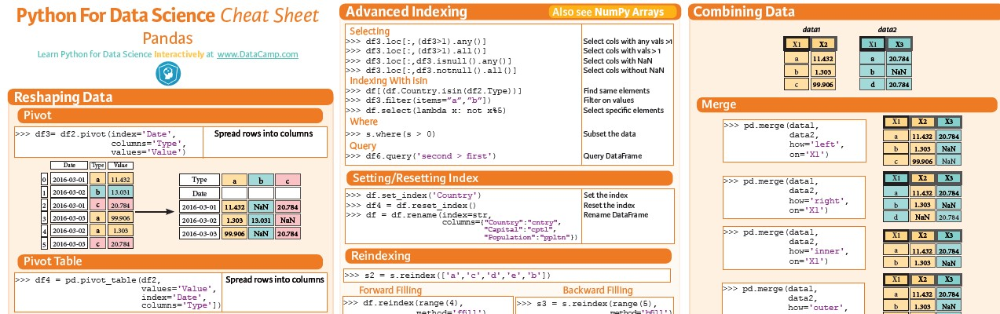
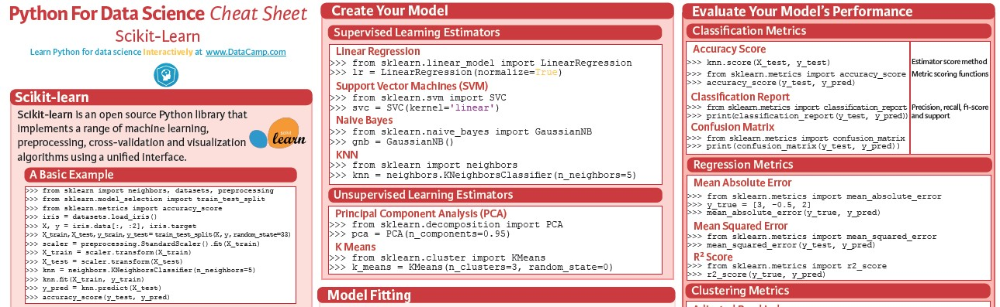
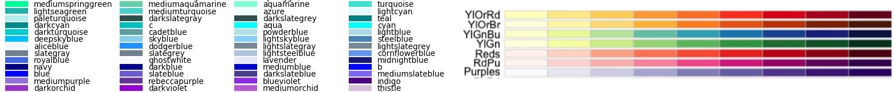

# Resoure Materials

I have collected several helpful resource materials (learning guides / cheat sheet) that provide good code snippets for many important or common tasks when using python, pandas, seaborn, color charts, and other libraries.

## Find helpful resources for Pandas
# 
  

## Several important libraries are also included, such as Scikit Learn
# 
  

## I have also included color charts to help giving color to plots
# 
  

## Author

* **Michael Davis** - [Davis1776](https://github.com/Davis1776)

## Acknowledgments

I have collected these resource guides from many sources including:

 

